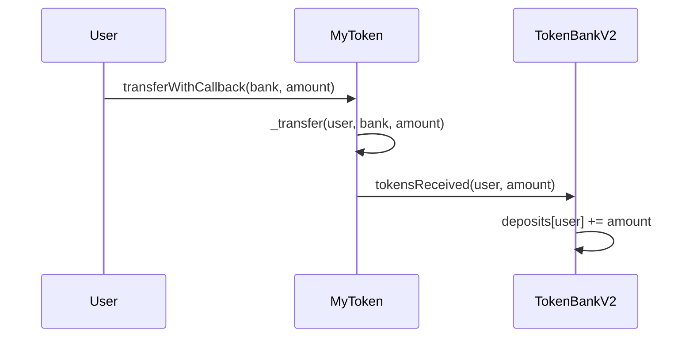

# tokensReceived 方法是干什么的

`tokensReceived` 是 **扩展 ERC20 存款的回调入口**：用户通过 `MyToken.transferWithCallback` 把币转进银行时，由代币合约在转账成功后调用，用来 **记账**。

---

## 调用链



1. 用户调用：`myToken.transferWithCallback(tokenBankV2地址, amount)`
2. `MyToken` 先把代币从用户转到 `TokenBankV2`
3. 若收款方是合约，再调用 `TokenBankV2.tokensReceived(用户地址, amount)`
4. `tokensReceived` 里更新 `deposits` 并发出 `Deposited` 事件

---

## 这两行在做什么

```solidity
function tokensReceived(address from, uint256 amount) external override {
    require(msg.sender == address(token), "TokenBankV2: not token");
    _creditDeposit(from, amount);
}
```

| 部分 | 含义 |
|------|------|
| `from` | 实际存款用户（转币的发送方） |
| `amount` | 本次转入数量 |
| `msg.sender == address(token)` | 只允许配置的 **MyToken 合约** 调用，防止别人伪造回调、凭空加余额 |
| `_creditDeposit(from, amount)` | 把金额记入 `deposits[from]`，并 `emit Deposited` |

---

## 和 `deposit()` 的区别

| 方式 | 流程 |
|------|------|
| `deposit()` | 先 `approve`，再 `deposit()`，银行用 `transferFrom` 拉币 |
| `transferWithCallback` | 一步转账 + 回调，**不需要 approve** |

`tokensReceived` 实现的是 `MyToken.sol` 里定义的 `ITokenReceiver` 接口，专门给「带回调的转账」用，和传统的 `approve + deposit()` 是两条存款路径，最终都写入同一个 `deposits` 映射。
